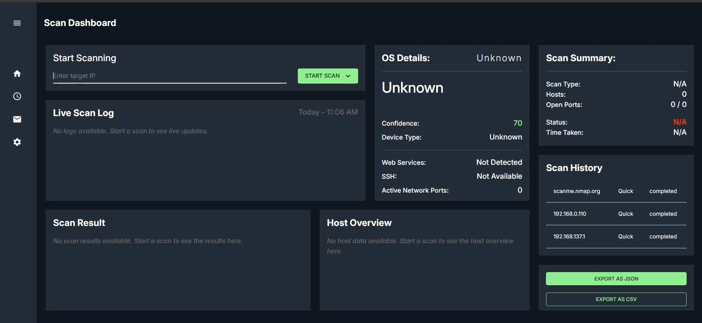
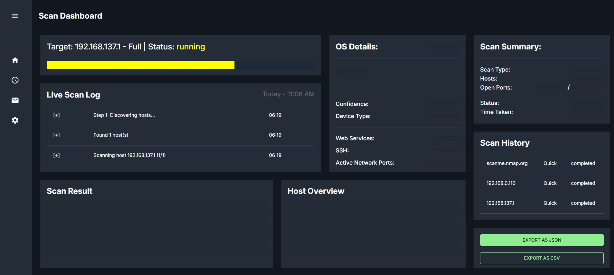
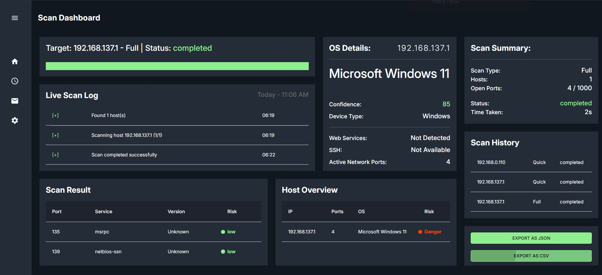

# 🔍 IP & Port Scanner Dashboard

> A full-stack network scanning dashboard built with **FastAPI**, **React**, **TypeScript**, and **Material UI** that performs real-time host discovery, port scanning, service detection, and risk assessment using **Nmap**.

<div align="center">


</div>

---

## 📋 Table of Contents

- [Features](#-features)
- [Scan Modes](#-scan-modes)
- [Tech Stack](#-tech-stack)
- [Project Structure](#-project-structure)
- [Installation](#-installation)
  - [Install Nmap](#1-install-nmap)
  - [Backend Setup](#-backend-setup)
  - [Frontend Setup](#-frontend-setup)
- [API Endpoints](#-api-endpoints)
- [Supported Targets](#-supported-targets)
- [Data Structures](#-data-structures)
- [Risk Assessment](#-risk-assessment-logic)
- [Dashboard Components](#-dashboard-components)
- [Export Features](#-export-features)
- [Performance](#-performance-expectations)
- [Future Improvements](#-future-improvements)
- [Disclaimer](#-disclaimer)
- [Author](#-author)
- [License](#-license)

---

## ✨ Features

- 🖥️ **Host Discovery** — Discover live hosts using Nmap
- 🔌 **Port Scanning** — Scan ports across single hosts or entire networks
- 🔎 **Service Detection** — Identify running services and versions
- 🧠 **OS Detection** — Detect operating systems on remote hosts
- 🌐 **Multi-Host Scanning** — Scan IP ranges and CIDR blocks simultaneously
- 📡 **Real-Time Scan Logs** — Live feedback during scan execution
- ⚠️ **Risk Assessment** — Automated risk scoring for exposed ports and hosts
- 📊 **Scan Summaries** — Concise overview of scan results
- 📤 **CSV Export** — Export port data as a flat CSV file
- 🗃️ **JSON Export** — Export complete raw scan data as JSON

---

## 🔬 Scan Modes

| Scan Type | Description | Speed | Ports Scanned |
|-----------|-------------|-------|---------------|
| **Quick Scan** | Fast scan of common ports | ⚡ Fast | Top 100 |
| **Standard Scan** | Balanced scan with service detection | 🔄 Medium | Top 1000 |
| **Full Scan** | Deep scan of all ports with service detection | 🐢 Slow | 65,535 |

---

## 🛠️ Tech Stack

### Frontend
| Technology | Purpose |
|------------|---------|
| **React** | UI framework |
| **TypeScript** | Type-safe JavaScript |
| **Material UI (MUI)** | Component library |
| **Vite** | Build tool & dev server |

### Backend
| Technology | Purpose |
|------------|---------|
| **FastAPI** | REST API framework |
| **Python** | Server-side language |
| **Nmap** | Network scanning engine |

---

## 📁 Project Structure

```
IP-Port-Scanner/
│
├── BackEnd/
│   ├── scanner/
│   │   ├── nmap_runner.py       # Nmap execution wrapper
│   │   ├── parser.py            # Scan output parser
│   │   ├── risk_engine.py       # Risk scoring logic
│   │   ├── scan_manager.py      # Scan lifecycle management
│   │   └── store.py             # In-memory scan store
│   │
│   ├── main.py                  # FastAPI entry point
│   └── requirements.txt
│
├── FrontEnd/
│   ├── src/
│   │   ├── Dashboard/           # Main dashboard view
│   │   ├── Components/          # Reusable UI components
│   │   ├── Api/                 # API client functions
│   │   ├── Types/               # TypeScript type definitions
│   │   └── Themes/              # MUI theme configuration
│   │
│   └── package.json
│
└── README.md
```

---

## 🚀 Installation

### 1. Clone Repository

```bash
git clone <your-repo-url>
cd IP-Port-Scanner
```

---

### 2. Install Nmap

#### Windows
Download and install from: [https://nmap.org/download.html](https://nmap.org/download.html)

#### Linux
```bash
sudo apt install nmap
```

#### Verify Installation
```bash
nmap --version
```

---

## ⚙️ Backend Setup

### 1. Navigate to Backend

```bash
cd BackEnd
```

### 2. Create Virtual Environment

```bash
python -m venv venv
```

### 3. Activate Virtual Environment

**Windows:**
```bash
venv\Scripts\activate
```

**Linux / macOS:**
```bash
source venv/bin/activate
```

### 4. Install Dependencies

```bash
pip install -r requirements.txt
```

### 5. Run Backend

```bash
uvicorn main:app --reload
```

| Resource | URL |
|----------|-----|
| **API Base** | `http://127.0.0.1:8000` |
| **Swagger Docs** | `http://127.0.0.1:8000/docs` |

---

## 🎨 Frontend Setup

### 1. Navigate to Frontend

```bash
cd FrontEnd
```

### 2. Install Dependencies

```bash
npm install
```

### 3. Run Frontend

```bash
npm run dev
```

| Resource | URL |
|----------|-----|
| **Dev Server** | `http://localhost:5173` |

---

## 📡 API Endpoints

### `POST /scan/start` — Start a Scan

**Request Body:**
```json
{
  "target": "scanme.nmap.org",
  "scan_type": "standard"
}
```

**Response:**
```json
{
  "scan_id": "1234-abcd"
}
```

---

### `GET /scan/{scan_id}` — Get Scan Result

Returns the full scan result for the given `scan_id`.

---

## 🎯 Supported Targets

| Type | Example |
|------|---------|
| **Single IP** | `192.168.0.201` |
| **Domain** | `scanme.nmap.org` |
| **IP Range** | `192.168.0.100-110` |
| **CIDR Network** | `192.168.0.0/24` |

---

## 📐 Data Structures

### `ScanData`
```ts
export type ScanData = {
  status:        "running" | "completed" | "error";
  target:        string;
  scan_type:     "quick" | "standard" | "full";
  logs:          Log[];
  nodes:         Node[];
  summary:       Summary;
  error_details?: string;
};
```

### `Log`
```ts
export type Log = {
  time:    string;
  message: string;
  type:    "info" | "error" | "success";
};
```

### `Node`
```ts
export type Node = {
  ip:              string;
  os:              string;
  ports:           Port[];
  vulnerabilities: string[];
};
```

### `Port`
```ts
export type Port = {
  port:    number;
  service: string;
  version: string;
  status:  "open";
  risk:    "low" | "medium" | "high";
};
```

### `Summary`
```ts
export type Summary = {
  hosts:       number;
  open_ports:  number;
  total_ports: number;
  status:      "completed";
  time_taken:  string;
};
```

---

## ⚠️ Risk Assessment Logic

### Port Risk Levels

| Risk | Example Ports |
|------|---------------|
| 🟢 **Low** | 80, 443 |
| 🟡 **Medium** | 22 |
| 🔴 **High** | 21, 23, 445, 3389 |

### Host Risk Scoring

Each open port contributes to a weighted score:

```
High Risk Port   → +5 points
Medium Risk Port → +3 points
Low Risk Port    → +1 point
```

**Final risk level:**

```
Score >= 10  →  🔴 High
Score >= 5   →  🟡 Medium
Score < 5    →  🟢 Low
```

---

## 🧩 Dashboard Components

| Component | Purpose |
|-----------|---------|
| **Progress Bar** | Start scans and show real-time progress |
| **Live Scan** | Display real-time scan logs |
| **Scan Summary** | Show overall scan metrics |
| **Scan Results** | Flattened ports table view |
| **Host Overview** | Per-host insights and risk levels |
| **OS Details** | Operating system information |
| **Scan History** | Browse and revisit previous scans |

---

## 📤 Export Features

### JSON Export
Exports the complete raw scan data object.

### CSV Export
Exports a flattened port table with the following columns:

```
IP, Port, Service, Version, Risk
```

---

## ⏱️ Performance Expectations

| Scan Type | Single Host | Multiple Hosts |
|-----------|-------------|----------------|
| **Quick** | 3–10 sec | 30–60 sec |
| **Standard** | 10–30 sec | 1–3 min |
| **Full** | 1–5 min | ⚠️ Very slow |

---
## Output

### Base state


## During Fetch


## Final Output display


---

## 🧪 Example Test Targets

```
# Your local machine
192.168.x.x

# Safe public target (authorized by Nmap)
scanme.nmap.org

# Local network range
192.168.0.100-110
```

---


## 👤 Author

**Padmesh S**

---


This project is licensed under the **MIT License** — see the [LICENSE](LICENSE) file for details.
